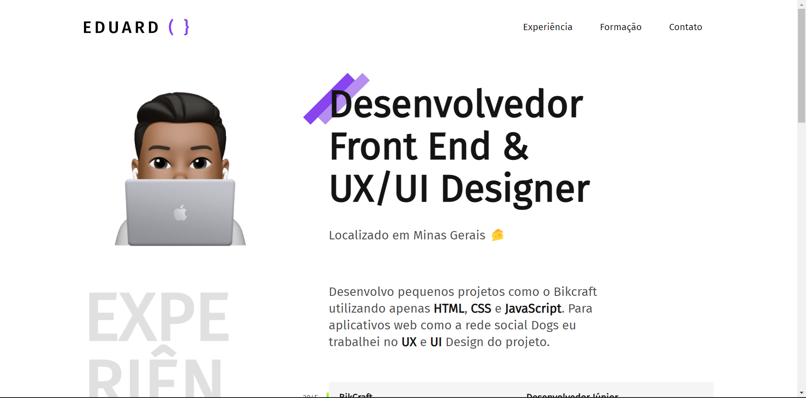
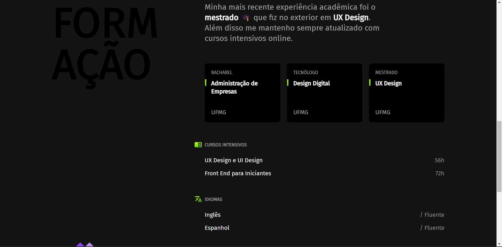
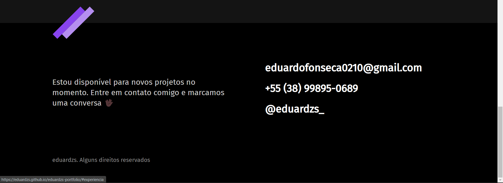

<h2>Portfolio Fictício da Origamid</h2>

<a href="https://eduardzs.github.io/portfolioFicticioOrigamid/" target="_blank">Link do Projeto<a>

Esse projeto foi feito visando a consolidação e a conclusão de um desafio proposto no curso de HTML & CSS da plataforma Origamid.

Para sua construção foram usados apenas ás tecnologias HTML & CSS.

    

    

    
    

    
    
    

